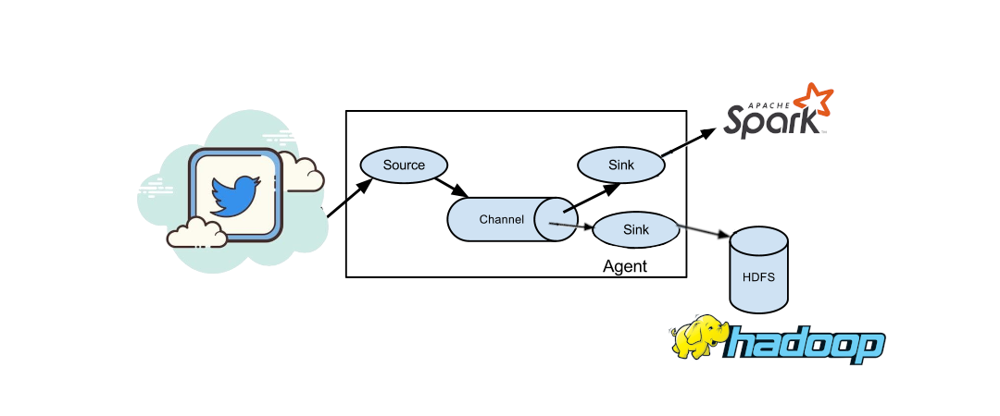

# Processamento de Streaming de Dados em Tempo Real Com Apache Flume, Spark Streaming e Hbase

## Projeto nº6 da Formação Cientista de Dados da Data Science Academy

***Disclaimer**: O projeto em questão tem apenas fins didáticos, desenvolvido em ambiente de teste e com dados públicos, sem qualquer preocupação com a segurança dos dados e sem a pretensão de servir de modelo para qualquer implementação em ambiente de produção. Os requisitos necessários para reprodução deste experimento são instalações funcionais do Apache Flume, Apache Hadoop e Apache Spark, com todos os requisitos necessários para cada um destes pacotes. Neste trabalho especificamente foi utilizada a máquina virtual fornecida pela Data Science Academy como ambiente de testes e desenvolvimento. Para utilização do Twitter como fonte do streaming de dados também são necessárias as chaves de acesso para desenvolvedor conforme mostrado adiante.*

O objetivo deste projeto é criar um pipeline de dados em streaming com processamento em tempo real utilizando ferramentas do ecossistema Hadoop, como o Apache Flume para ingestão de dados, Apache HBase para armazenamento em *cluster* e Apache Spark para processamento em tempo real. Como fonte de dados em tempo real será utilizado o *Twitter*, que será acessado através da API para o Apache Flume. A figura 1 ilustra o fluxograma do processamento de dados, com os dados sendo coletados da fonte em tempo real pelo Apache Flume, armazenados no HBase e processados em tempo real com o Spark Streaming.



O projeto será executado em 3 etapas, a saber:
1. Estabelecimento do *Flume Agent* que coleta os dados do *Twitter* em tempo real, e distribui para duas *sinks*, o Apache HBase para armazenamento em *cluster* e o Spark Streaming para processamento em tempo real;
2. Armazenamento dos dados no cluster Hadoop através do Apache HBase;
3. Processamento dos dados em tempo real com o Spark Streaming.


## Etapa 1: Estabelecimento do *Flume Agent*:

Para estabelecimento do *Flume agent* foi seguido o template mostrado na documentação do [Apache Flume](http://flume.apache.org/releases/content/1.9.0/FlumeUserGuide.html), conforme mostrado no exemplo abaixo, onde são declaradas as fontes, os *sinks* e os canais do agente, e em seguida cada um destes componentes são descritos:

```
# example.conf: A single-node Flume configuration

# Name the components on this agent
a1.sources = r1
a1.sinks = k1
a1.channels = c1

# Describe/configure the source
a1.sources.r1.type = netcat
a1.sources.r1.bind = localhost
a1.sources.r1.port = 44444

# Describe the sink
a1.sinks.k1.type = logger

# Use a channel which buffers events in memory
a1.channels.c1.type = memory
a1.channels.c1.capacity = 1000
a1.channels.c1.transactionCapacity = 100

# Bind the source and sink to the channel
a1.sources.r1.channels = c1
a1.sinks.k1.channel = c1
```
Para o estabelecimento de um agente como o mostrado na figura 1, é necessária a substituição da fonte r1 pela fonte do *Twitter*, a substituição da fonte k1 pela fonte do HBase e a criação de mais uma fonte do tipo *avro* para fazer a conexão com o Apache Spark.


Alteração da fonte r1 para a fonte Twitter, seguindo a documentação do Apache Flume:

```
a1.sources = r1
a1.channels = c1
a1.sources.r1.type = org.apache.flume.source.twitter.TwitterSource
a1.sources.r1.channels = c1
a1.sources.r1.consumerKey = YOUR_TWITTER_CONSUMER_KEY
a1.sources.r1.consumerSecret = YOUR_TWITTER_CONSUMER_SECRET
a1.sources.r1.accessToken = YOUR_TWITTER_ACCESS_TOKEN
a1.sources.r1.accessTokenSecret = YOUR_TWITTER_ACCESS_TOKEN_SECRET
a1.sources.r1.maxBatchSize = 10
a1.sources.r1.maxBatchDurationMillis = 200
```

```
# example.conf: A single-node Flume configuration

# Name the components on this agent
a1.sources = r1
a1.sinks = k1
a1.channels = c1

# Describe/configure the source
a1.sources = r1
a1.channels = c1
a1.sources.r1.type = org.apache.flume.source.twitter.TwitterSource
a1.sources.r1.channels = c1
a1.sources.r1.consumerKey = YOUR_TWITTER_CONSUMER_KEY
a1.sources.r1.consumerSecret = YOUR_TWITTER_CONSUMER_SECRET
a1.sources.r1.accessToken = YOUR_TWITTER_ACCESS_TOKEN
a1.sources.r1.accessTokenSecret = YOUR_TWITTER_ACCESS_TOKEN_SECRET
a1.sources.r1.maxBatchSize = 10
a1.sources.r1.maxBatchDurationMillis = 200


# Describe the sink
a1.sinks.k1.type = logger

# Use a channel which buffers events in memory
a1.channels.c1.type = memory
a1.channels.c1.capacity = 1000
a1.channels.c1.transactionCapacity = 100

# Bind the source and sink to the channel
a1.sources.r1.channels = c1
a1.sinks.k1.channel = c1
```

Quando jogado os dados do Twitter para o console:
```
[hadoop@dataserver Projeto_6]$ flume-ng agent --conf conf --conf-file example.conf --name a1 -Dflume.root.logger=INFO
Info: Including Hadoop libraries found via (/opt/hadoop/bin/hadoop) for HDFS access
Info: Including HBASE libraries found via (/opt/hbase/bin/hbase) for HBASE access
Error: Could not find or load main class org.apache.hadoop.hbase.util.GetJavaProperty
Info: Including Hive libraries found via (/opt/hive) for Hive access
+ exec /opt/jdk/bin/java -Xmx20m -Dflume.root.logger=INFO -cp 'conf:/opt/flume/lib/*:/opt/hadoop/etc/hadoop:/opt/hadoop/share/hadoop/common/lib/*:/opt/hadoop/share/hadoop/common/*:/opt/hadoop/share/hadoop/hdfs:/opt/hadoop/share/hadoop/hdfs/lib/*:/opt/hadoop/share/hadoop/hdfs/*:/opt/hadoop/share/hadoop/mapreduce/lib/*:/opt/hadoop/share/hadoop/mapreduce/*:/opt/hadoop/share/hadoop/yarn:/opt/hadoop/share/hadoop/yarn/lib/*:/opt/hadoop/share/hadoop/yarn/*:/opt/hbase/conf:/opt/jdk//lib/tools.jar:/opt/hbase:/opt/hbase/lib/shaded-clients/hbase-shaded-client-byo-hadoop-2.2.0.jar:/opt/hbase/lib/client-facing-thirdparty/audience-annotations-0.5.0.jar:/opt/hbase/lib/client-facing-thirdparty/commons-logging-1.2.jar:/opt/hbase/lib/client-facing-thirdparty/findbugs-annotations-1.3.9-1.jar:/opt/hbase/lib/client-facing-thirdparty/htrace-core4-4.2.0-incubating.jar:/opt/hbase/lib/client-facing-thirdparty/log4j-1.2.17.jar:/opt/hbase/lib/client-facing-thirdparty/slf4j-api-1.7.25.jar:/opt/hadoop/etc/hadoop:/opt/hadoop/share/hadoop/common/lib/*:/opt/hadoop/share/hadoop/common/*:/opt/hadoop/share/hadoop/hdfs:/opt/hadoop/share/hadoop/hdfs/lib/*:/opt/hadoop/share/hadoop/hdfs/*:/opt/hadoop/share/hadoop/mapreduce/lib/*:/opt/hadoop/share/hadoop/mapreduce/*:/opt/hadoop/share/hadoop/yarn:/opt/hadoop/share/hadoop/yarn/lib/*:/opt/hadoop/share/hadoop/yarn/*:/opt/hbase/conf:/opt/hive/lib/*' -Djava.library.path=:/opt/hadoop/lib/native:/opt/hadoop/lib/native org.apache.flume.node.Application --conf-file example.conf --name a1
SLF4J: Class path contains multiple SLF4J bindings.
SLF4J: Found binding in [jar:file:/opt/flume/lib/slf4j-log4j12-1.7.25.jar!/org/slf4j/impl/StaticLoggerBinder.class]
SLF4J: Found binding in [jar:file:/opt/hadoop/share/hadoop/common/lib/slf4j-log4j12-1.7.25.jar!/org/slf4j/impl/StaticLoggerBinder.class]
SLF4J: Found binding in [jar:file:/opt/hive/lib/log4j-slf4j-impl-2.10.0.jar!/org/slf4j/impl/StaticLoggerBinder.class]
SLF4J: See http://www.slf4j.org/codes.html#multiple_bindings for an explanation.
log4j:ERROR setFile(null,true) call failed.
java.io.FileNotFoundException: ./fairscheduler-statedump.log (Permission denied)
	at java.io.FileOutputStream.open0(Native Method)
	at java.io.FileOutputStream.open(FileOutputStream.java:270)
	at java.io.FileOutputStream.<init>(FileOutputStream.java:213)
	at java.io.FileOutputStream.<init>(FileOutputStream.java:133)
	at org.apache.log4j.FileAppender.setFile(FileAppender.java:294)
	at org.apache.log4j.RollingFileAppender.setFile(RollingFileAppender.java:207)
	at org.apache.log4j.FileAppender.activateOptions(FileAppender.java:165)
	at org.apache.log4j.config.PropertySetter.activate(PropertySetter.java:307)
	at org.apache.log4j.config.PropertySetter.setProperties(PropertySetter.java:172)
	at org.apache.log4j.config.PropertySetter.setProperties(PropertySetter.java:104)
	at org.apache.log4j.PropertyConfigurator.parseAppender(PropertyConfigurator.java:842)
	at org.apache.log4j.PropertyConfigurator.parseCategory(PropertyConfigurator.java:768)
	at org.apache.log4j.PropertyConfigurator.parseCatsAndRenderers(PropertyConfigurator.java:672)
	at org.apache.log4j.PropertyConfigurator.doConfigure(PropertyConfigurator.java:516)
	at org.apache.log4j.PropertyConfigurator.doConfigure(PropertyConfigurator.java:580)
	at org.apache.log4j.helpers.OptionConverter.selectAndConfigure(OptionConverter.java:526)
	at org.apache.log4j.LogManager.<clinit>(LogManager.java:127)
	at org.slf4j.impl.Log4jLoggerFactory.<init>(Log4jLoggerFactory.java:66)
	at org.slf4j.impl.StaticLoggerBinder.<init>(StaticLoggerBinder.java:72)
	at org.slf4j.impl.StaticLoggerBinder.<clinit>(StaticLoggerBinder.java:45)
	at org.slf4j.LoggerFactory.bind(LoggerFactory.java:150)
	at org.slf4j.LoggerFactory.performInitialization(LoggerFactory.java:124)
	at org.slf4j.LoggerFactory.getILoggerFactory(LoggerFactory.java:412)
	at org.slf4j.LoggerFactory.getLogger(LoggerFactory.java:357)
	at org.slf4j.LoggerFactory.getLogger(LoggerFactory.java:383)
	at org.apache.flume.node.Application.<clinit>(Application.java:61)
SLF4J: Actual binding is of type [org.slf4j.impl.Log4jLoggerFactory]
2021-05-26 20:29:04,596 INFO node.PollingPropertiesFileConfigurationProvider: Configuration provider starting
2021-05-26 20:29:04,616 INFO node.PollingPropertiesFileConfigurationProvider: Reloading configuration file:example.conf
2021-05-26 20:29:04,619 INFO conf.FlumeConfiguration: Processing:r1
2021-05-26 20:29:04,620 INFO conf.FlumeConfiguration: Processing:c1
2021-05-26 20:29:04,620 INFO conf.FlumeConfiguration: Processing:r1
2021-05-26 20:29:04,620 INFO conf.FlumeConfiguration: Processing:r1
2021-05-26 20:29:04,620 INFO conf.FlumeConfiguration: Added sinks: k1 Agent: a1
2021-05-26 20:29:04,620 INFO conf.FlumeConfiguration: Processing:r1
2021-05-26 20:29:04,620 INFO conf.FlumeConfiguration: Processing:r1
2021-05-26 20:29:04,620 INFO conf.FlumeConfiguration: Processing:k1
2021-05-26 20:29:04,620 INFO conf.FlumeConfiguration: Processing:r1
2021-05-26 20:29:04,620 INFO conf.FlumeConfiguration: Processing:k1
2021-05-26 20:29:04,620 INFO conf.FlumeConfiguration: Processing:c1
2021-05-26 20:29:04,620 INFO conf.FlumeConfiguration: Processing:r1
2021-05-26 20:29:04,620 INFO conf.FlumeConfiguration: Processing:r1
2021-05-26 20:29:04,620 INFO conf.FlumeConfiguration: Processing:c1
2021-05-26 20:29:04,620 WARN conf.FlumeConfiguration: Agent configuration for 'a1' has no configfilters.
2021-05-26 20:29:04,686 INFO conf.FlumeConfiguration: Post-validation flume configuration contains configuration for agents: [a1]
2021-05-26 20:29:04,686 INFO node.AbstractConfigurationProvider: Creating channels
2021-05-26 20:29:04,690 INFO channel.DefaultChannelFactory: Creating instance of channel c1 type memory
2021-05-26 20:29:04,715 INFO node.AbstractConfigurationProvider: Created channel c1
2021-05-26 20:29:04,715 INFO source.DefaultSourceFactory: Creating instance of source r1, type org.apache.flume.source.twitter.TwitterSource
2021-05-26 20:29:05,045 INFO sink.DefaultSinkFactory: Creating instance of sink: k1, type: logger
2021-05-26 20:29:05,047 INFO node.AbstractConfigurationProvider: Channel c1 connected to [r1, k1]
2021-05-26 20:29:05,051 INFO node.Application: Starting new configuration:{ sourceRunners:{r1=EventDrivenSourceRunner: { source:org.apache.flume.source.twitter.TwitterSource{name:r1,state:IDLE} }} sinkRunners:{k1=SinkRunner: { policy:org.apache.flume.sink.DefaultSinkProcessor@64023fcf counterGroup:{ name:null counters:{} } }} channels:{c1=org.apache.flume.channel.MemoryChannel{name: c1}} }
2021-05-26 20:29:05,054 INFO node.Application: Starting Channel c1
2021-05-26 20:29:05,079 INFO node.Application: Waiting for channel: c1 to start. Sleeping for 500 ms
2021-05-26 20:29:05,211 INFO instrumentation.MonitoredCounterGroup: Monitored counter group for type: CHANNEL, name: c1: Successfully registered new MBean.
2021-05-26 20:29:05,211 INFO instrumentation.MonitoredCounterGroup: Component type: CHANNEL, name: c1 started
2021-05-26 20:29:05,581 INFO node.Application: Starting Sink k1
2021-05-26 20:29:05,581 INFO node.Application: Starting Source r1
2021-05-26 20:29:05,582 INFO twitter.TwitterSource: Starting twitter source org.apache.flume.source.twitter.TwitterSource{name:r1,state:IDLE} ...
2021-05-26 20:29:05,586 INFO twitter.TwitterSource: Twitter source r1 started.
2021-05-26 20:29:05,586 INFO twitter4j.TwitterStreamImpl: Establishing connection.
2021-05-26 20:29:10,467 INFO twitter4j.TwitterStreamImpl: Connection established.
2021-05-26 20:29:10,467 INFO twitter4j.TwitterStreamImpl: Receiving status stream.
2021-05-26 20:29:10,869 INFO sink.LoggerSink: Event: { headers:{} body: 4F 62 6A 01 02 16 61 76 72 6F 2E 73 63 68 65 6D Obj...avro.schem }
2021-05-26 20:29:11,034 INFO sink.LoggerSink: Event: { headers:{} body: 4F 62 6A 01 02 16 61 76 72 6F 2E 73 63 68 65 6D Obj...avro.schem }
2021-05-26 20:29:11,055 INFO sink.LoggerSink: Event: { headers:{} body: 4F 62 6A 01 02 16 61 76 72 6F 2E 73 63 68 65 6D Obj...avro.schem }
2021-05-26 20:29:11,122 INFO sink.LoggerSink: Event: { headers:{} body: 4F 62 6A 01 02 16 61 76 72 6F 2E 73 63 68 65 6D Obj...avro.schem }
2021-05-26 20:29:11,135 INFO sink.LoggerSink: Event: { headers:{} body: 4F 62 6A 01 02 16 61 76 72 6F 2E 73 63 68 65 6D Obj...avro.schem }
2021-05-26 20:29:11,861 INFO sink.LoggerSink: Event: { headers:{} body: 4F 62 6A 01 02 16 61 76 72 6F 2E 73 63 68 65 6D Obj...avro.schem }
2021-05-26 20:29:11,861 INFO sink.LoggerSink: Event: { headers:{} body: 4F 62 6A 01 02 16 61 76 72 6F 2E 73 63 68 65 6D Obj...avro.schem }
2021-05-26 20:29:11,862 INFO sink.LoggerSink: Event: { headers:{} body: 4F 62 6A 01 02 16 61 76 72 6F 2E 73 63 68 65 6D Obj...avro.schem }
2021-05-26 20:29:11,912 INFO sink.LoggerSink: Event: { headers:{} body: 4F 62 6A 01 02 16 61 76 72 6F 2E 73 63 68 65 6D Obj...avro.schem }
2021-05-26 20:29:12,051 INFO sink.LoggerSink: Event: { headers:{} body: 4F 62 6A 01 02 16 61 76 72 6F 2E 73 63 68 65 6D Obj...avro.schem }
2021-05-26 20:29:12,223 INFO sink.LoggerSink: Event: { headers:{} body: 4F 62 6A 01 02 16 61 76 72 6F 2E 73 63 68 65 6D Obj...avro.schem }
2021-05-26 20:29:13,252 INFO twitter.TwitterSource: Processed 100 docs
2021-05-26 20:29:13,271 INFO sink.LoggerSink: Event: { headers:{} body: 4F 62 6A 01 02 16 61 76 72 6F 2E 73 63 68 65 6D Obj...avro.schem }
2021-05-26 20:29:13,298 INFO sink.LoggerSink: Event: { headers:{} body: 4F 62 6A 01 02 16 61 76 72 6F 2E 73 63 68 65 6D Obj...avro.schem }
2021-05-26 20:29:13,298 INFO sink.LoggerSink: Event: { headers:{} body: 4F 62 6A 01 02 16 61 76 72 6F 2E 73 63 68 65 6D Obj...avro.schem }
2021-05-26 20:29:13,298 INFO sink.LoggerSink: Event: { headers:{} body: 4F 62 6A 01 02 16 61 76 72 6F 2E 73 63 68 65 6D Obj...avro.schem }
2021-05-26 20:29:13,299 INFO sink.LoggerSink: Event: { headers:{} body: 4F 62 6A 01 02 16 61 76 72 6F 2E 73 63 68 65 6D Obj...avro.schem }
2021-05-26 20:29:13,340 INFO sink.LoggerSink: Event: { headers:{} body: 4F 62 6A 01 02 16 61 76 72 6F 2E 73 63 68 65 6D Obj...avro.schem }
2021-05-26 20:29:13,860 INFO sink.LoggerSink: Event: { headers:{} body: 4F 62 6A 01 02 16 61 76 72 6F 2E 73 63 68 65 6D Obj...avro.schem }
2021-05-26 20:29:13,860 INFO sink.LoggerSink: Event: { headers:{} body: 4F 62 6A 01 02 16 61 76 72 6F 2E 73 63 68 65 6D Obj...avro.schem }
2021-05-26 20:29:14,510 INFO sink.LoggerSink: Event: { headers:{} body: 4F 62 6A 01 02 16 61 76 72 6F 2E 73 63 68 65 6D Obj...avro.schem }
2021-05-26 20:29:14,510 INFO sink.LoggerSink: Event: { headers:{} body: 4F 62 6A 01 02 16 61 76 72 6F 2E 73 63 68 65 6D Obj...avro.schem }
2021-05-26 20:29:14,712 INFO twitter.TwitterSource: Processed 200 docs
2021-05-26 20:29:14,714 INFO sink.LoggerSink: Event: { headers:{} body: 4F 62 6A 01 02 16 61 76 72 6F 2E 73 63 68 65 6D Obj...avro.schem }
2021-05-26 20:29:14,714 INFO sink.LoggerSink: Event: { headers:{} body: 4F 62 6A 01 02 16 61 76 72 6F 2E 73 63 68 65 6D Obj...avro.schem }
2021-05-26 20:29:14,715 INFO sink.LoggerSink: Event: { headers:{} body: 4F 62 6A 01 02 16 61 76 72 6F 2E 73 63 68 65 6D Obj...avro.schem }
2021-05-26 20:29:14,793 INFO sink.LoggerSink: Event: { headers:{} body: 4F 62 6A 01 02 16 61 76 72 6F 2E 73 63 68 65 6D Obj...avro.schem }
2021-05-26 20:29:15,116 INFO sink.LoggerSink: Event: { headers:{} body: 4F 62 6A 01 02 16 61 76 72 6F 2E 73 63 68 65 6D Obj...avro.schem }
2021-05-26 20:29:15,116 INFO sink.LoggerSink: Event: { headers:{} body: 4F 62 6A 01 02 16 61 76 72 6F 2E 73 63 68 65 6D Obj...avro.schem }
2021-05-26 20:29:15,116 INFO sink.LoggerSink: Event: { headers:{} body: 4F 62 6A 01 02 16 61 76 72 6F 2E 73 63 68 65 6D Obj...avro.schem }
2021-05-26 20:29:15,939 INFO sink.LoggerSink: Event: { headers:{} body: 4F 62 6A 01 02 16 61 76 72 6F 2E 73 63 68 65 6D Obj...avro.schem }
2021-05-26 20:29:15,939 INFO sink.LoggerSink: Event: { headers:{} body: 4F 62 6A 01 02 16 61 76 72 6F 2E 73 63 68 65 6D Obj...avro.schem }
2021-05-26 20:29:15,939 INFO sink.LoggerSink: Event: { headers:{} body: 4F 62 6A 01 02 16 61 76 72 6F 2E 73 63 68 65 6D Obj...avro.schem }
2021-05-26 20:29:15,939 INFO sink.LoggerSink: Event: { headers:{} body: 4F 62 6A 01 02 16 61 76 72 6F 2E 73 63 68 65 6D Obj...avro.schem }
2021-05-26 20:29:16,133 INFO twitter.TwitterSource: Processed 300 docs
2021-05-26 20:29:16,136 INFO sink.LoggerSink: Event: { headers:{} body: 4F 62 6A 01 02 16 61 76 72 6F 2E 73 63 68 65 6D Obj...avro.schem }
2021-05-26 20:29:16,136 INFO sink.LoggerSink: Event: { headers:{} body: 4F 62 6A 01 02 16 61 76 72 6F 2E 73 63 68 65 6D Obj...avro.schem }
2021-05-26 20:29:16,925 INFO sink.LoggerSink: Event: { headers:{} body: 4F 62 6A 01 02 16 61 76 72 6F 2E 73 63 68 65 6D Obj...avro.schem }
2021-05-26 20:29:16,938 INFO sink.LoggerSink: Event: { headers:{} body: 4F 62 6A 01 02 16 61 76 72 6F 2E 73 63 68 65 6D Obj...avro.schem }
2021-05-26 20:29:16,938 INFO sink.LoggerSink: Event: { headers:{} body: 4F 62 6A 01 02 16 61 76 72 6F 2E 73 63 68 65 6D Obj...avro.schem }
2021-05-26 20:29:16,938 INFO sink.LoggerSink: Event: { headers:{} body: 4F 62 6A 01 02 16 61 76 72 6F 2E 73 63 68 65 6D Obj...avro.schem }
2021-05-26 20:29:18,168 INFO sink.LoggerSink: Event: { headers:{} body: 4F 62 6A 01 02 16 61 76 72 6F 2E 73 63 68 65 6D Obj...avro.schem }
2021-05-26 20:29:18,452 INFO sink.LoggerSink: Event: { headers:{} body: 4F 62 6A 01 02 16 61 76 72 6F 2E 73 63 68 65 6D Obj...avro.schem }
2021-05-26 20:29:18,489 INFO sink.LoggerSink: Event: { headers:{} body: 4F 62 6A 01 02 16 61 76 72 6F 2E 73 63 68 65 6D Obj...avro.schem }
2021-05-26 20:29:18,489 INFO sink.LoggerSink: Event: { headers:{} body: 4F 62 6A 01 02 16 61 76 72 6F 2E 73 63 68 65 6D Obj...avro.schem }
2021-05-26 20:29:18,980 INFO sink.LoggerSink: Event: { headers:{} body: 4F 62 6A 01 02 16 61 76 72 6F 2E 73 63 68 65 6D Obj...avro.schem }
2021-05-26 20:29:19,016 INFO twitter.TwitterSource: Processed 400 docs
2021-05-26 20:29:19,020 INFO sink.LoggerSink: Event: { headers:{} body: 4F 62 6A 01 02 16 61 76 72 6F 2E 73 63 68 65 6D Obj...avro.schem }
2021-05-26 20:29:19,020 INFO sink.LoggerSink: Event: { headers:{} body: 4F 62 6A 01 02 16 61 76 72 6F 2E 73 63 68 65 6D Obj...avro.schem }
2021-05-26 20:29:19,020 INFO sink.LoggerSink: Event: { headers:{} body: 4F 62 6A 01 02 16 61 76 72 6F 2E 73 63 68 65 6D Obj...avro.schem }
2021-05-26 20:29:19,020 INFO sink.LoggerSink: Event: { headers:{} body: 4F 62 6A 01 02 16 61 76 72 6F 2E 73 63 68 65 6D Obj...avro.schem }
2021-05-26 20:29:19,214 INFO sink.LoggerSink: Event: { headers:{} body: 4F 62 6A 01 02 16 61 76 72 6F 2E 73 63 68 65 6D Obj...avro.schem }
2021-05-26 20:29:19,214 INFO sink.LoggerSink: Event: { headers:{} body: 4F 62 6A 01 02 16 61 76 72 6F 2E 73 63 68 65 6D Obj...avro.schem }
2021-05-26 20:29:19,214 INFO sink.LoggerSink: Event: { headers:{} body: 4F 62 6A 01 02 16 61 76 72 6F 2E 73 63 68 65 6D Obj...avro.schem }
2021-05-26 20:29:19,805 INFO sink.LoggerSink: Event: { headers:{} body: 4F 62 6A 01 02 16 61 76 72 6F 2E 73 63 68 65 6D Obj...avro.schem }
2021-05-26 20:29:19,805 INFO sink.LoggerSink: Event: { headers:{} body: 4F 62 6A 01 02 16 61 76 72 6F 2E 73 63 68 65 6D Obj...avro.schem }
2021-05-26 20:29:20,023 INFO sink.LoggerSink: Event: { headers:{} body: 4F 62 6A 01 02 16 61 76 72 6F 2E 73 63 68 65 6D Obj...avro.schem }
2021-05-26 20:29:20,217 INFO twitter.TwitterSource: Processed 500 docs
2021-05-26 20:29:20,230 INFO sink.LoggerSink: Event: { headers:{} body: 4F 62 6A 01 02 16 61 76 72 6F 2E 73 63 68 65 6D Obj...avro.schem }
2021-05-26 20:29:20,230 INFO sink.LoggerSink: Event: { headers:{} body: 4F 62 6A 01 02 16 61 76 72 6F 2E 73 63 68 65 6D Obj...avro.schem }
2021-05-26 20:29:20,230 INFO sink.LoggerSink: Event: { headers:{} body: 4F 62 6A 01 02 16 61 76 72 6F 2E 73 63 68 65 6D Obj...avro.schem }
2021-05-26 20:29:20,827 INFO sink.LoggerSink: Event: { headers:{} body: 4F 62 6A 01 02 16 61 76 72 6F 2E 73 63 68 65 6D Obj...avro.schem }
2021-05-26 20:29:20,839 INFO sink.LoggerSink: Event: { headers:{} body: 4F 62 6A 01 02 16 61 76 72 6F 2E 73 63 68 65 6D Obj...avro.schem }
2021-05-26 20:29:20,839 INFO sink.LoggerSink: Event: { headers:{} body: 4F 62 6A 01 02 16 61 76 72 6F 2E 73 63 68 65 6D Obj...avro.schem }
2021-05-26 20:29:21,024 INFO sink.LoggerSink: Event: { headers:{} body: 4F 62 6A 01 02 16 61 76 72 6F 2E 73 63 68 65 6D Obj...avro.schem }
2021-05-26 20:29:21,047 INFO sink.LoggerSink: Event: { headers:{} body: 4F 62 6A 01 02 16 61 76 72 6F 2E 73 63 68 65 6D Obj...avro.schem }
2021-05-26 20:29:21,646 INFO sink.LoggerSink: Event: { headers:{} body: 4F 62 6A 01 02 16 61 76 72 6F 2E 73 63 68 65 6D Obj...avro.schem }
2021-05-26 20:29:21,845 INFO sink.LoggerSink: Event: { headers:{} body: 4F 62 6A 01 02 16 61 76 72 6F 2E 73 63 68 65 6D Obj...avro.schem }
2021-05-26 20:29:21,913 INFO sink.LoggerSink: Event: { headers:{} body: 4F 62 6A 01 02 16 61 76 72 6F 2E 73 63 68 65 6D Obj...avro.schem }
2021-05-26 20:29:21,913 INFO sink.LoggerSink: Event: { headers:{} body: 4F 62 6A 01 02 16 61 76 72 6F 2E 73 63 68 65 6D Obj...avro.schem }
2021-05-26 20:29:21,919 INFO sink.LoggerSink: Event: { headers:{} body: 4F 62 6A 01 02 16 61 76 72 6F 2E 73 63 68 65 6D Obj...avro.schem }
2021-05-26 20:29:22,053 INFO twitter.TwitterSource: Processed 600 docs
2021-05-26 20:29:22,056 INFO sink.LoggerSink: Event: { headers:{} body: 4F 62 6A 01 02 16 61 76 72 6F 2E 73 63 68 65 6D Obj...avro.schem }
2021-05-26 20:29:22,863 INFO sink.LoggerSink: Event: { headers:{} body: 4F 62 6A 01 02 16 61 76 72 6F 2E 73 63 68 65 6D Obj...avro.schem }
2021-05-26 20:29:22,875 INFO sink.LoggerSink: Event: { headers:{} body: 4F 62 6A 01 02 16 61 76 72 6F 2E 73 63 68 65 6D Obj...avro.schem }
2021-05-26 20:29:23,087 INFO sink.LoggerSink: Event: { headers:{} body: 4F 62 6A 01 02 16 61 76 72 6F 2E 73 63 68 65 6D Obj...avro.schem }
2021-05-26 20:29:23,291 INFO sink.LoggerSink: Event: { headers:{} body: 4F 62 6A 01 02 16 61 76 72 6F 2E 73 63 68 65 6D Obj...avro.schem }
2021-05-26 20:29:23,291 INFO sink.LoggerSink: Event: { headers:{} body: 4F 62 6A 01 02 16 61 76 72 6F 2E 73 63 68 65 6D Obj...avro.schem }
2021-05-26 20:29:23,291 INFO sink.LoggerSink: Event: { headers:{} body: 4F 62 6A 01 02 16 61 76 72 6F 2E 73 63 68 65 6D Obj...avro.schem }
2021-05-26 20:29:23,781 INFO sink.LoggerSink: Event: { headers:{} body: 4F 62 6A 01 02 16 61 76 72 6F 2E 73 63 68 65 6D Obj...avro.schem }
2021-05-26 20:29:23,811 INFO sink.LoggerSink: Event: { headers:{} body: 4F 62 6A 01 02 16 61 76 72 6F 2E 73 63 68 65 6D Obj...avro.schem }
2021-05-26 20:29:23,813 INFO sink.LoggerSink: Event: { headers:{} body: 4F 62 6A 01 02 16 61 76 72 6F 2E 73 63 68 65 6D Obj...avro.schem }
2021-05-26 20:29:23,957 INFO sink.LoggerSink: Event: { headers:{} body: 4F 62 6A 01 02 16 61 76 72 6F 2E 73 63 68 65 6D Obj...avro.schem }
2021-05-26 20:29:23,962 INFO twitter.TwitterSource: Processed 700 docs
2021-05-26 20:29:23,964 INFO sink.LoggerSink: Event: { headers:{} body: 4F 62 6A 01 02 16 61 76 72 6F 2E 73 63 68 65 6D Obj...avro.schem }
2021-05-26 20:29:24,774 INFO sink.LoggerSink: Event: { headers:{} body: 4F 62 6A 01 02 16 61 76 72 6F 2E 73 63 68 65 6D Obj...avro.schem }
2021-05-26 20:29:24,789 INFO sink.LoggerSink: Event: { headers:{} body: 4F 62 6A 01 02 16 61 76 72 6F 2E 73 63 68 65 6D Obj...avro.schem }
2021-05-26 20:29:24,806 INFO sink.LoggerSink: Event: { headers:{} body: 4F 62 6A 01 02 16 61 76 72 6F 2E 73 63 68 65 6D Obj...avro.schem }
2021-05-26 20:29:25,124 INFO sink.LoggerSink: Event: { headers:{} body: 4F 62 6A 01 02 16 61 76 72 6F 2E 73 63 68 65 6D Obj...avro.schem }
2021-05-26 20:29:25,135 INFO sink.LoggerSink: Event: { headers:{} body: 4F 62 6A 01 02 16 61 76 72 6F 2E 73 63 68 65 6D Obj...avro.schem }
2021-05-26 20:29:25,776 INFO sink.LoggerSink: Event: { headers:{} body: 4F 62 6A 01 02 16 61 76 72 6F 2E 73 63 68 65 6D Obj...avro.schem }
2021-05-26 20:29:25,809 INFO sink.LoggerSink: Event: { headers:{} body: 4F 62 6A 01 02 16 61 76 72 6F 2E 73 63 68 65 6D Obj...avro.schem }
2021-05-26 20:29:25,809 INFO sink.LoggerSink: Event: { headers:{} body: 4F 62 6A 01 02 16 61 76 72 6F 2E 73 63 68 65 6D Obj...avro.schem }
2021-05-26 20:29:25,958 INFO sink.LoggerSink: Event: { headers:{} body: 4F 62 6A 01 02 16 61 76 72 6F 2E 73 63 68 65 6D Obj...avro.schem }
2021-05-26 20:29:25,966 INFO sink.LoggerSink: Event: { headers:{} body: 4F 62 6A 01 02 16 61 76 72 6F 2E 73 63 68 65 6D Obj...avro.schem }
2021-05-26 20:29:27,225 INFO sink.LoggerSink: Event: { headers:{} body: 4F 62 6A 01 02 16 61 76 72 6F 2E 73 63 68 65 6D Obj...avro.schem }
2021-05-26 20:29:27,389 INFO twitter.TwitterSource: Processed 800 docs
2021-05-26 20:29:27,401 INFO sink.LoggerSink: Event: { headers:{} body: 4F 62 6A 01 02 16 61 76 72 6F 2E 73 63 68 65 6D Obj...avro.schem }
2021-05-26 20:29:27,401 INFO sink.LoggerSink: Event: { headers:{} body: 4F 62 6A 01 02 16 61 76 72 6F 2E 73 63 68 65 6D Obj...avro.schem }
2021-05-26 20:29:27,401 INFO sink.LoggerSink: Event: { headers:{} body: 4F 62 6A 01 02 16 61 76 72 6F 2E 73 63 68 65 6D Obj...avro.schem }
2021-05-26 20:29:27,401 INFO sink.LoggerSink: Event: { headers:{} body: 4F 62 6A 01 02 16 61 76 72 6F 2E 73 63 68 65 6D Obj...avro.schem }
2021-05-26 20:29:27,401 INFO sink.LoggerSink: Event: { headers:{} body: 4F 62 6A 01 02 16 61 76 72 6F 2E 73 63 68 65 6D Obj...avro.schem }
2021-05-26 20:29:27,989 INFO sink.LoggerSink: Event: { headers:{} body: 4F 62 6A 01 02 16 61 76 72 6F 2E 73 63 68 65 6D Obj...avro.schem }
2021-05-26 20:29:28,027 INFO sink.LoggerSink: Event: { headers:{} body: 4F 62 6A 01 02 16 61 76 72 6F 2E 73 63 68 65 6D Obj...avro.schem }
2021-05-26 20:29:28,027 INFO sink.LoggerSink: Event: { headers:{} body: 4F 62 6A 01 02 16 61 76 72 6F 2E 73 63 68 65 6D Obj...avro.schem }
2021-05-26 20:29:28,228 INFO sink.LoggerSink: Event: { headers:{} body: 4F 62 6A 01 02 16 61 76 72 6F 2E 73 63 68 65 6D Obj...avro.schem }
2021-05-26 20:29:28,228 INFO sink.LoggerSink: Event: { headers:{} body: 4F 62 6A 01 02 16 61 76 72 6F 2E 73 63 68 65 6D Obj...avro.schem }
2021-05-26 20:29:28,810 INFO sink.LoggerSink: Event: { headers:{} body: 4F 62 6A 01 02 16 61 76 72 6F 2E 73 63 68 65 6D Obj...avro.schem }
2021-05-26 20:29:28,826 INFO twitter.TwitterSource: Processed 900 docs
2021-05-26 20:29:28,832 INFO sink.LoggerSink: Event: { headers:{} body: 4F 62 6A 01 02 16 61 76 72 6F 2E 73 63 68 65 6D Obj...avro.schem }
2021-05-26 20:29:28,832 INFO sink.LoggerSink: Event: { headers:{} body: 4F 62 6A 01 02 16 61 76 72 6F 2E 73 63 68 65 6D Obj...avro.schem }
2021-05-26 20:29:29,023 INFO sink.LoggerSink: Event: { headers:{} body: 4F 62 6A 01 02 16 61 76 72 6F 2E 73 63 68 65 6D Obj...avro.schem }
2021-05-26 20:29:29,249 INFO sink.LoggerSink: Event: { headers:{} body: 4F 62 6A 01 02 16 61 76 72 6F 2E 73 63 68 65 6D Obj...avro.schem }
2021-05-26 20:29:30,038 INFO sink.LoggerSink: Event: { headers:{} body: 4F 62 6A 01 02 16 61 76 72 6F 2E 73 63 68 65 6D Obj...avro.schem }
2021-05-26 20:29:30,148 INFO sink.LoggerSink: Event: { headers:{} body: 4F 62 6A 01 02 16 61 76 72 6F 2E 73 63 68 65 6D Obj...avro.schem }
2021-05-26 20:29:30,148 INFO sink.LoggerSink: Event: { headers:{} body: 4F 62 6A 01 02 16 61 76 72 6F 2E 73 63 68 65 6D Obj...avro.schem }
2021-05-26 20:29:30,148 INFO sink.LoggerSink: Event: { headers:{} body: 4F 62 6A 01 02 16 61 76 72 6F 2E 73 63 68 65 6D Obj...avro.schem }
2021-05-26 20:29:30,148 INFO sink.LoggerSink: Event: { headers:{} body: 4F 62 6A 01 02 16 61 76 72 6F 2E 73 63 68 65 6D Obj...avro.schem }
2021-05-26 20:29:30,855 INFO sink.LoggerSink: Event: { headers:{} body: 4F 62 6A 01 02 16 61 76 72 6F 2E 73 63 68 65 6D Obj...avro.schem }
2021-05-26 20:29:30,875 INFO twitter.TwitterSource: Processed 1,000 docs
2021-05-26 20:29:30,875 INFO twitter.TwitterSource: Total docs indexed: 1,000, total skipped docs: 0
2021-05-26 20:29:30,875 INFO twitter.TwitterSource:     40 docs/second
2021-05-26 20:29:30,875 INFO twitter.TwitterSource: Run took 25 seconds and processed:
2021-05-26 20:29:30,877 INFO twitter.TwitterSource:     0.01 MB/sec sent to index
2021-05-26 20:29:30,877 INFO twitter.TwitterSource:     0.262 MB text sent to index
2021-05-26 20:29:30,877 INFO twitter.TwitterSource: There were 0 exceptions ignored: 
2021-05-26 20:29:30,877 INFO sink.LoggerSink: Event: { headers:{} body: 4F 62 6A 01 02 16 61 76 72 6F 2E 73 63 68 65 6D Obj...avro.schem }
2021-05-26 20:29:31,105 INFO sink.LoggerSink: Event: { headers:{} body: 4F 62 6A 01 02 16 61 76 72 6F 2E 73 63 68 65 6D Obj...avro.schem }
2021-05-26 20:29:31,105 INFO sink.LoggerSink: Event: { headers:{} body: 4F 62 6A 01 02 16 61 76 72 6F 2E 73 63 68 65 6D Obj...avro.schem }
2021-05-26 20:29:31,105 INFO sink.LoggerSink: Event: { headers:{} body: 4F 62 6A 01 02 16 61 76 72 6F 2E 73 63 68 65 6D Obj...avro.schem }
2021-05-26 20:29:31,105 INFO sink.LoggerSink: Event: { headers:{} body: 4F 62 6A 01 02 16 61 76 72 6F 2E 73 63 68 65 6D Obj...avro.schem }
2021-05-26 20:29:31,772 INFO sink.LoggerSink: Event: { headers:{} body: 4F 62 6A 01 02 16 61 76 72 6F 2E 73 63 68 65 6D Obj...avro.schem }
2021-05-26 20:29:31,830 INFO sink.LoggerSink: Event: { headers:{} body: 4F 62 6A 01 02 16 61 76 72 6F 2E 73 63 68 65 6D Obj...avro.schem }
2021-05-26 20:29:31,979 INFO sink.LoggerSink: Event: { headers:{} body: 4F 62 6A 01 02 16 61 76 72 6F 2E 73 63 68 65 6D Obj...avro.schem }
2021-05-26 20:29:32,009 INFO sink.LoggerSink: Event: { headers:{} body: 4F 62 6A 01 02 16 61 76 72 6F 2E 73 63 68 65 6D Obj...avro.schem }
2021-05-26 20:29:32,009 INFO sink.LoggerSink: Event: { headers:{} body: 4F 62 6A 01 02 16 61 76 72 6F 2E 73 63 68 65 6D Obj...avro.schem }
2021-05-26 20:29:32,292 INFO sink.LoggerSink: Event: { headers:{} body: 4F 62 6A 01 02 16 61 76 72 6F 2E 73 63 68 65 6D Obj...avro.schem }
2021-05-26 20:29:32,781 INFO sink.LoggerSink: Event: { headers:{} body: 4F 62 6A 01 02 16 61 76 72 6F 2E 73 63 68 65 6D Obj...avro.schem }
2021-05-26 20:29:32,792 INFO sink.LoggerSink: Event: { headers:{} body: 4F 62 6A 01 02 16 61 76 72 6F 2E 73 63 68 65 6D Obj...avro.schem }
2021-05-26 20:29:32,798 INFO twitter.TwitterSource: Processed 1,100 docs
2021-05-26 20:29:32,810 INFO sink.LoggerSink: Event: { headers:{} body: 4F 62 6A 01 02 16 61 76 72 6F 2E 73 63 68 65 6D Obj...avro.schem }
2021-05-26 20:29:33,109 INFO sink.LoggerSink: Event: { headers:{} body: 4F 62 6A 01 02 16 61 76 72 6F 2E 73 63 68 65 6D Obj...avro.schem }
2021-05-26 20:29:33,149 INFO sink.LoggerSink: Event: { headers:{} body: 4F 62 6A 01 02 16 61 76 72 6F 2E 73 63 68 65 6D Obj...avro.schem }
^C2021-05-26 20:29:33,343 INFO node.Application: Shutting down configuration: { sourceRunners:{r1=EventDrivenSourceRunner: { source:org.apache.flume.source.twitter.TwitterSource{name:r1,state:START} }} sinkRunners:{k1=SinkRunner: { policy:org.apache.flume.sink.DefaultSinkProcessor@64023fcf counterGroup:{ name:null counters:{runner.backoffs.consecutive=0, runner.backoffs=1} } }} channels:{c1=org.apache.flume.channel.MemoryChannel{name: c1}} }
2021-05-26 20:29:33,343 INFO node.Application: Stopping Source r1
2021-05-26 20:29:33,344 INFO lifecycle.LifecycleSupervisor: Stopping component: EventDrivenSourceRunner: { source:org.apache.flume.source.twitter.TwitterSource{name:r1,state:START} }
2021-05-26 20:29:33,344 INFO twitter.TwitterSource: Twitter source r1 stopping...
2021-05-26 20:29:33,831 INFO twitter4j.TwitterStreamImpl: Inflater has been closed
2021-05-26 20:29:33,832 ERROR twitter.TwitterSource: Exception while streaming tweets
java.lang.NullPointerException: Inflater has been closed
	at java.util.zip.Inflater.ensureOpen(Inflater.java:389)
	at java.util.zip.Inflater.inflate(Inflater.java:257)
	at java.util.zip.InflaterInputStream.read(InflaterInputStream.java:152)
	at java.util.zip.GZIPInputStream.read(GZIPInputStream.java:117)
	at sun.nio.cs.StreamDecoder.readBytes(StreamDecoder.java:284)
	at sun.nio.cs.StreamDecoder.implRead(StreamDecoder.java:326)
	at sun.nio.cs.StreamDecoder.read(StreamDecoder.java:178)
	at java.io.InputStreamReader.read(InputStreamReader.java:184)
	at java.io.BufferedReader.fill(BufferedReader.java:161)
	at java.io.BufferedReader.readLine(BufferedReader.java:324)
	at java.io.BufferedReader.readLine(BufferedReader.java:389)
	at twitter4j.StatusStreamBase.handleNextElement(StatusStreamBase.java:85)
	at twitter4j.StatusStreamImpl.next(StatusStreamImpl.java:57)
	at twitter4j.TwitterStreamImpl$TwitterStreamConsumer.run(TwitterStreamImpl.java:478)
2021-05-26 20:29:33,837 INFO twitter.TwitterSource: Twitter source r1 stopped.
2021-05-26 20:29:33,837 INFO node.Application: Stopping Sink k1
2021-05-26 20:29:33,837 INFO lifecycle.LifecycleSupervisor: Stopping component: SinkRunner: { policy:org.apache.flume.sink.DefaultSinkProcessor@64023fcf counterGroup:{ name:null counters:{runner.backoffs.consecutive=0, runner.backoffs=1} } }
2021-05-26 20:29:33,840 INFO node.Application: Stopping Channel c1
2021-05-26 20:29:33,840 INFO lifecycle.LifecycleSupervisor: Stopping component: org.apache.flume.channel.MemoryChannel{name: c1}
2021-05-26 20:29:33,840 INFO instrumentation.MonitoredCounterGroup: Component type: CHANNEL, name: c1 stopped
2021-05-26 20:29:33,840 INFO instrumentation.MonitoredCounterGroup: Shutdown Metric for type: CHANNEL, name: c1. channel.start.time == 1622086145211
2021-05-26 20:29:33,840 INFO instrumentation.MonitoredCounterGroup: Shutdown Metric for type: CHANNEL, name: c1. channel.stop.time == 1622086173840
2021-05-26 20:29:33,840 INFO instrumentation.MonitoredCounterGroup: Shutdown Metric for type: CHANNEL, name: c1. channel.capacity == 1000
2021-05-26 20:29:33,840 INFO instrumentation.MonitoredCounterGroup: Shutdown Metric for type: CHANNEL, name: c1. channel.current.size == 0
2021-05-26 20:29:33,840 INFO instrumentation.MonitoredCounterGroup: Shutdown Metric for type: CHANNEL, name: c1. channel.event.put.attempt == 126
2021-05-26 20:29:33,840 INFO instrumentation.MonitoredCounterGroup: Shutdown Metric for type: CHANNEL, name: c1. channel.event.put.success == 126
2021-05-26 20:29:33,840 INFO instrumentation.MonitoredCounterGroup: Shutdown Metric for type: CHANNEL, name: c1. channel.event.take.attempt == 128
2021-05-26 20:29:33,840 INFO instrumentation.MonitoredCounterGroup: Shutdown Metric for type: CHANNEL, name: c1. channel.event.take.success == 126
2021-05-26 20:29:33,840 INFO lifecycle.LifecycleSupervisor: Stopping lifecycle supervisor 10
2021-05-26 20:29:33,846 INFO node.PollingPropertiesFileConfigurationProvider: Configuration provider stopping

```

Quando jogados dados do Telnet para o HDFS:
```
2021-05-27 21:04:46,877 ERROR hdfs.HDFSEventSink: process failed
java.lang.NullPointerException: Expected timestamp in the Flume event headers, but it was null
	at com.google.common.base.Preconditions.checkNotNull(Preconditions.java:204)
	at org.apache.flume.formatter.output.BucketPath.replaceShorthand(BucketPath.java:251)
	at org.apache.flume.formatter.output.BucketPath.escapeString(BucketPath.java:460)
	at org.apache.flume.sink.hdfs.HDFSEventSink.process(HDFSEventSink.java:379)
	at org.apache.flume.sink.DefaultSinkProcessor.process(DefaultSinkProcessor.java:67)
	at org.apache.flume.SinkRunner$PollingRunner.run(SinkRunner.java:145)
	at java.lang.Thread.run(Thread.java:748)

```

Quando jogados dados do Telnet para o HBase:
```
java.net.ConnectException: Connection refused
	at sun.nio.ch.SocketChannelImpl.checkConnect(Native Method)
	at sun.nio.ch.SocketChannelImpl.finishConnect(SocketChannelImpl.java:717)
	at org.apache.hadoop.hbase.shaded.org.apache.zookeeper.ClientCnxnSocketNIO.doTransport(ClientCnxnSocketNIO.java:361)
	at org.apache.hadoop.hbase.shaded.org.apache.zookeeper.ClientCnxn$SendThread.run(ClientCnxn.java:1141)
2021-05-27 21:10:18,986 INFO zookeeper.ClientCnxn: Opening socket connection to server localhost/127.0.0.1:2181. Will not attempt to authenticate using SASL (unknown error)
2021-05-27 21:10:18,986 WARN zookeeper.ClientCnxn: Session 0x0 for server null, unexpected error, closing socket connection and attempting reconnect
java.net.ConnectException: Connection refused
	at sun.nio.ch.SocketChannelImpl.checkConnect(Native Method)
	at sun.nio.ch.SocketChannelImpl.finishConnect(SocketChannelImpl.java:717)
	at org.apache.hadoop.hbase.shaded.org.apache.zookeeper.ClientCnxnSocketNIO.doTransport(ClientCnxnSocketNIO.java:361)
	at org.apache.hadoop.hbase.shaded.org.apache.zookeeper.ClientCnxn$SendThread.run(ClientCnxn.java:1141)
2021-05-27 21:10:18,987 WARN zookeeper.ReadOnlyZKClient: 0x74db17b1 to localhost:2181 failed for get of /hbase/hbaseid, code = CONNECTIONLOSS, retries = 19
^C2021-05-27 21:10:20,087 INFO zookeeper.ClientCnxn: Opening socket connection to server localhost/0:0:0:0:0:0:0:1:2181. Will not attempt to authenticate using SASL (unknown error)
2021-05-27 21:10:20,088 WARN zookeeper.ClientCnxn: Session 0x0 for server null, unexpected error, closing socket connection and attempting reconnect
java.net.ConnectException: Connection refused
	at sun.nio.ch.SocketChannelImpl.checkConnect(Native Method)
	at sun.nio.ch.SocketChannelImpl.finishConnect(SocketChannelImpl.java:717)
	at org.apache.hadoop.hbase.shaded.org.apache.zookeeper.ClientCnxnSocketNIO.doTransport(ClientCnxnSocketNIO.java:361)
	at org.apache.hadoop.hbase.shaded.org.apache.zookeeper.ClientCnxn$SendThread.run(ClientCnxn.java:1141)
2021-05-27 21:10:20,189 INFO zookeeper.ClientCnxn: Opening socket connection to server localhost/127.0.0.1:2181. Will not attempt to authenticate using SASL (unknown error)
2021-05-27 21:10:20,189 WARN zookeeper.ClientCnxn: Session 0x0 for server null, unexpected error, closing socket connection and attempting reconnect
java.net.ConnectException: Connection refused
	at sun.nio.ch.SocketChannelImpl.checkConnect(Native Method)
	at sun.nio.ch.SocketChannelImpl.finishConnect(SocketChannelImpl.java:717)
	at org.apache.hadoop.hbase.shaded.org.apache.zookeeper.ClientCnxnSocketNIO.doTransport(ClientCnxnSocketNIO.java:361)
	at org.apache.hadoop.hbase.shaded.org.apache.zookeeper.ClientCnxn$SendThread.run(ClientCnxn.java:1141)
2021-05-27 21:10:20,190 WARN zookeeper.ReadOnlyZKClient: 0x74db17b1 to localhost:2181 failed for get of /hbase/hbaseid, code = CONNECTIONLOSS, retries = 20
^C^C2021-05-27 21:10:21,293 INFO zookeeper.ClientCnxn: Opening socket connection to server localhost/0:0:0:0:0:0:0:1:2181. Will not attempt to authenticate using SASL (unknown error)
2021-05-27 21:10:21,294 WARN zookeeper.ClientCnxn: Session 0x0 for server null, unexpected error, closing socket connection and attempting reconnect
java.net.ConnectException: Connection refused
	at sun.nio.ch.SocketChannelImpl.checkConnect(Native Method)
	at sun.nio.ch.SocketChannelImpl.finishConnect(SocketChannelImpl.java:717)
	at org.apache.hadoop.hbase.shaded.org.apache.zookeeper.ClientCnxnSocketNIO.doTransport(ClientCnxnSocketNIO.java:361)
	at org.apache.hadoop.hbase.shaded.org.apache.zookeeper.ClientCnxn$SendThread.run(ClientCnxn.java:1141)
2021-05-27 21:10:21,394 INFO zookeeper.ClientCnxn: Opening socket connection to server localhost/127.0.0.1:2181. Will not attempt to authenticate using SASL (unknown error)
2021-05-27 21:10:21,395 WARN zookeeper.ClientCnxn: Session 0x0 for server null, unexpected error, closing socket connection and attempting reconnect
java.net.ConnectException: Connection refused
	at sun.nio.ch.SocketChannelImpl.checkConnect(Native Method)
	at sun.nio.ch.SocketChannelImpl.finishConnect(SocketChannelImpl.java:717)
	at org.apache.hadoop.hbase.shaded.org.apache.zookeeper.ClientCnxnSocketNIO.doTransport(ClientCnxnSocketNIO.java:361)
	at org.apache.hadoop.hbase.shaded.org.apache.zookeeper.ClientCnxn$SendThread.run(ClientCnxn.java:1141)
2021-05-27 21:10:21,397 WARN zookeeper.ReadOnlyZKClient: 0x74db17b1 to localhost:2181 failed for get of /hbase/hbaseid, code = CONNECTIONLOSS, retries = 21
^C^C2021-05-27 21:10:22,497 INFO zookeeper.ClientCnxn: Opening socket connection to server localhost/0:0:0:0:0:0:0:1:2181. Will not attempt to authenticate using SASL (unknown error)
2021-05-27 21:10:22,497 WARN zookeeper.ClientCnxn: Session 0x0 for server null, unexpected error, closing socket connection and attempting reconnect
java.net.ConnectException: Connection refused
	at sun.nio.ch.SocketChannelImpl.checkConnect(Native Method)
	at sun.nio.ch.SocketChannelImpl.finishConnect(SocketChannelImpl.java:717)
	at org.apache.hadoop.hbase.shaded.org.apache.zookeeper.ClientCnxnSocketNIO.doTransport(ClientCnxnSocketNIO.java:361)
	at org.apache.hadoop.hbase.shaded.org.apache.zookeeper.ClientCnxn$SendThread.run(ClientCnxn.java:1141)
2021-05-27 21:10:22,598 INFO zookeeper.ClientCnxn: Opening socket connection to server localhost/127.0.0.1:2181. Will not attempt to authenticate using SASL (unknown error)
2021-05-27 21:10:22,599 WARN zookeeper.ClientCnxn: Session 0x0 for server null, unexpected error, closing socket connection and attempting reconnect
java.net.ConnectException: Connection refused
	at sun.nio.ch.SocketChannelImpl.checkConnect(Native Method)
	at sun.nio.ch.SocketChannelImpl.finishConnect(SocketChannelImpl.java:717)
	at org.apache.hadoop.hbase.shaded.org.apache.zookeeper.ClientCnxnSocketNIO.doTransport(ClientCnxnSocketNIO.java:361)
	at org.apache.hadoop.hbase.shaded.org.apache.zookeeper.ClientCnxn$SendThread.run(ClientCnxn.java:1141)
2021-05-27 21:10:22,599 WARN zookeeper.ReadOnlyZKClient: 0x74db17b1 to localhost:2181 failed for get of /hbase/hbaseid, code = CONNECTIONLOSS, retries = 22
2021-05-27 21:10:23,702 INFO zookeeper.ClientCnxn: Opening socket connection to server localhost/0:0:0:0:0:0:0:1:2181. Will not attempt to authenticate using SASL (unknown error)
2021-05-27 21:10:23,703 WARN zookeeper.ClientCnxn: Session 0x0 for server null, unexpected error, closing socket connection and attempting reconnect
java.net.ConnectException: Connection refused
	at sun.nio.ch.SocketChannelImpl.checkConnect(Native Method)
	at sun.nio.ch.SocketChannelImpl.finishConnect(SocketChannelImpl.java:717)
	at org.apache.hadoop.hbase.shaded.org.apache.zookeeper.ClientCnxnSocketNIO.doTransport(ClientCnxnSocketNIO.java:361)
	at org.apache.hadoop.hbase.shaded.org.apache.zookeeper.ClientCnxn$SendThread.run(ClientCnxn.java:1141)
2021-05-27 21:10:23,803 INFO zookeeper.ClientCnxn: Opening socket connection to server localhost/127.0.0.1:2181. Will not attempt to authenticate using SASL (unknown error)
2021-05-27 21:10:23,804 WARN zookeeper.ClientCnxn: Session 0x0 for server null, unexpected error, closing socket connection and attempting reconnect
java.net.ConnectException: Connection refused
	at sun.nio.ch.SocketChannelImpl.checkConnect(Native Method)
	at sun.nio.ch.SocketChannelImpl.finishConnect(SocketChannelImpl.java:717)
	at org.apache.hadoop.hbase.shaded.org.apache.zookeeper.ClientCnxnSocketNIO.doTransport(ClientCnxnSocketNIO.java:361)
	at org.apache.hadoop.hbase.shaded.org.apache.zookeeper.ClientCnxn$SendThread.run(ClientCnxn.java:1141)
2021-05-27 21:10:23,804 WARN zookee
```