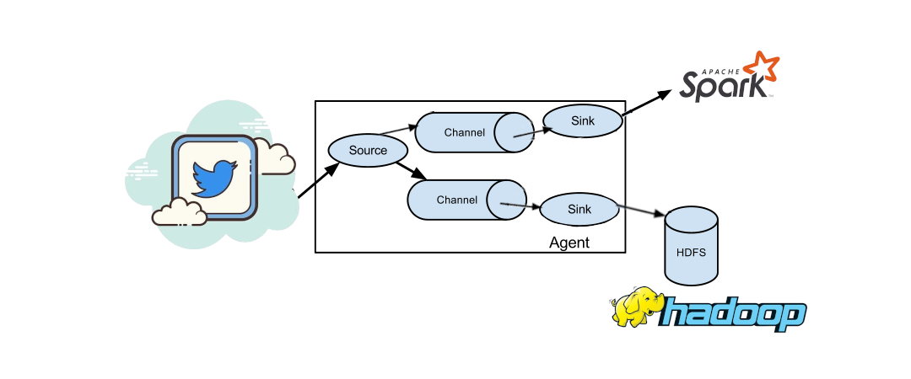

# Processamento de Streaming de Dados em Tempo Real Com Apache Hadoop, Apache Flume e Spark Streaming

## Projeto nº6 da Formação Cientista de Dados da Data Science Academy

***Disclaimer**: O projeto em questão tem apenas fins didáticos, desenvolvido em ambiente de teste e com dados públicos, sem qualquer preocupação com a segurança dos dados e sem a pretensão de servir de modelo para qualquer implementação em ambiente de produção. Os requisitos necessários para reprodução deste experimento são instalações funcionais do Apache Flume, Apache Hadoop e Apache Spark, com todos os requisitos necessários para cada um destes pacotes. Neste trabalho especificamente foi utilizada a máquina virtual fornecida pela Data Science Academy como ambiente de testes e desenvolvimento. Para utilização do Twitter como fonte do streaming de dados também são necessárias as chaves de acesso para desenvolvedor conforme mostrado adiante.*

O objetivo deste projeto é criar um pipeline de dados em streaming com processamento em tempo real utilizando ferramentas do ecossistema Hadoop, como o Apache Flume para ingestão de dados, o sistema de arquivos HDFS do Hadoop para armazenamento em *cluster* e Apache Spark para processamento em tempo real. Como fonte de dados em tempo real será utilizado o *Twitter*, que será acessado através da API para o Apache Flume. A figura 1 ilustra o fluxograma do processamento de dados, com os dados sendo coletados da fonte em tempo real pelo Apache Flume, armazenados no HBase e processados em tempo real com o Spark Streaming.



O projeto será executado em 3 etapas, a saber:
1. Estabelecimento do *Flume Agent* que coleta os dados do *Twitter* em tempo real, e distribui para duas *sinks*, o Apache HBase para armazenamento em *cluster* e o Spark Streaming para processamento em tempo real;
2. Armazenamento dos dados no cluster Hadoop diretamente no sistema de arquivos HDFS;
3. Processamento dos dados em tempo real com o Spark Streaming.


## Etapa 1: Estabelecimento do *Flume Agent*:

Para estabelecimento do *Flume agent* foi seguido o template mostrado na documentação do [Apache Flume](http://flume.apache.org/releases/content/1.9.0/FlumeUserGuide.html), conforme mostrado no exemplo abaixo, onde são declaradas as fontes, os *sinks* e os canais do agente, e em seguida cada um destes componentes são descritos:

```
# example.conf: A single-node Flume configuration

# Name the components on this agent
a1.sources = r1
a1.sinks = k1
a1.channels = c1

# Describe/configure the source
a1.sources.r1.type = netcat
a1.sources.r1.bind = localhost
a1.sources.r1.port = 44444

# Describe the sink
a1.sinks.k1.type = logger

# Use a channel which buffers events in memory
a1.channels.c1.type = memory
a1.channels.c1.capacity = 1000
a1.channels.c1.transactionCapacity = 100

# Bind the source and sink to the channel
a1.sources.r1.channels = c1
a1.sinks.k1.channel = c1
```
Para o estabelecimento de um agente como o mostrado na figura 1, é necessária a substituição da fonte r1 pela fonte do *Twitter*, a substituição da sink k1 pela fonte do HDFS e a criação de mais um canal e uma fonte do tipo *avro* para fazer a conexão com o Apache Spark.


Alteração da fonte r1 para a fonte Twitter, seguindo a documentação do Apache Flume:

```
a1.sources = r1
a1.channels = c1
a1.sources.r1.type = org.apache.flume.source.twitter.TwitterSource
a1.sources.r1.channels = c1
a1.sources.r1.consumerKey = YOUR_TWITTER_CONSUMER_KEY
a1.sources.r1.consumerSecret = YOUR_TWITTER_CONSUMER_SECRET
a1.sources.r1.accessToken = YOUR_TWITTER_ACCESS_TOKEN
a1.sources.r1.accessTokenSecret = YOUR_TWITTER_ACCESS_TOKEN_SECRET
a1.sources.r1.maxBatchSize = 10
a1.sources.r1.maxBatchDurationMillis = 200
```

As demais alterações também seguem as diretrizes dadas na documentação do Apache Flume. As configurações do arquivo agent.conf são exibidas abaixo:

```
# Processamento de Streaming de Dados em Tempo Real Com Apache Hadoop, Apache Flume e Spark Streaming

# Instanciando os componentes
a1.sources = r1
a1.sinks = k1 k2
a1.channels = c1 c2


# Descricao da fonte
# Twitter
a1.sources.r1.type = org.apache.flume.source.twitter.TwitterSource

a1.sources.r1.consumerKey = YOUR_TWITTER_CONSUMER_KEY
a1.sources.r1.consumerSecret = YOUR_TWITTER_CONSUMER_SECRET
a1.sources.r1.accessToken = YOUR_TWITTER_ACCESS_TOKEN
a1.sources.r1.accessTokenSecret = YOUR_TWITTER_ACCESS_TOKEN_SECRET

a1.sources.r1.maxBatchSize = 10
a1.sources.r1.maxBatchDurationMillis = 200
a1.sources.r1.selector.type = replicating


# Descricao das sinks
# Sink k1 do tipo HDFS
a1.sinks.k1.type = hdfs
a1.sinks.k1.hdfs.path = /flume/events/%y-%m-%d/%H%M/%S
a1.sinks.k1.hdfs.filePrefix = events-
a1.sinks.k1.hdfs.round = true
a1.sinks.k1.hdfs.roundValue = 10
a1.sinks.k1.hdfs.roundUnit = minute
a1.sinks.k1.hdfs.useLocalTimeStamp = true

# Sink k2 do tipo Avro
a1.sinks.k2.type = avro
a1.sinks.k2.hostname = localhost
a1.sinks.k2.port = 4545

# Use a channel which buffers events in memory
a1.channels.c1.type = memory
a1.channels.c1.capacity = 1000
a1.channels.c1.transactionCapacity = 100

# Use a channel which buffers events in memory
a1.channels.c2.type = memory
a1.channels.c2.capacity = 1000
a1.channels.c2.transactionCapacity = 100

# Descrevendo o fluxo de dados
a1.sources.r1.channels = c1 c2
a1.sinks.k1.channel = c1
a1.sinks.k2.channel = c2
```

A execução do agente flume se dá com o comando:
```
flume-ng agent --conf conf --conf-file agent.conf --name a1 -Dflume.root.logger=INFO,console
```

## Etapa 2: Armazenamento dos dados do Twitter no HDFS:

A gravação dos dados no HDFS se dá através da configuração de uma sink HDFS e sua ligação com o canal do Flume. Em nosso experimento, foi utilizada a mesma configuração mostrada no exemplo da documentação do Apache Flume:

```
a1.sinks.k1.type = hdfs
a1.sinks.k1.channel = c1
a1.sinks.k1.hdfs.path = /flume/events/%y-%m-%d/%H%M/%S
a1.sinks.k1.hdfs.filePrefix = events-
a1.sinks.k1.hdfs.round = true
a1.sinks.k1.hdfs.roundValue = 10
a1.sinks.k1.hdfs.roundUnit = minute
```
Uma amostra log do console exibido durante a gravação dos dados do Twitter para o HDFS através do Flume pode ser visto no arquivo Twitter_to_HDFS.log anexo.

O trecho abaixo mostra que os dados brutos gravados no HDFS são não-estruturados, apresentando texto, imagem, nome de usuário, diversos links, datas, contadores e demais metadados. Abrindo o link pode-se verificar que trata-se de um *tweet* publicado no instante em que estava sendo feita a ingestão de dados.
```
[hadoop@dataserver Projeto_6]$ hdfs dfs -cat /flume/events/21-05-29/1930/00/events-.1622341994132
{"type":"record","name":"Doc","doc":"adoc","fields":[{"name":"id","type":"string"},{"name":"user_friends_count","type":["int","null"]},{"name":"user_location","type":["string","null"]},{"name":"user_description","type":["string","null"]},{"name":"user_statuses_count","type":["int","null"]},{"name":"user_followers_count","type":["int","null"]},{"name":"user_name","type":["string","null"]},{"name":"user_screen_name","type":["string","null"]},{"name":"created_at","type":["string","null"]},{"name":"text","type":["string","null"]},{"name":"retweet_count","type":["long","null"]},{"name":"retweeted","type":["boolean","null"]},{"name":"in_reply_to_user_id","type":["long","null"]},{"name":"source","type":["string","null"]},{"name":"in_reply_to_status_id","type":["long","null"]},{"name":"media_url_https","type":["string","null"]},{"name":"expanded_url","type":["string","null"]}]}��WH�6~�!���F,��&1398829798672125957�in yours prayer>Laugh with many, dont trust any��👻Fareezaizat17(2021-05-29T19:33:07Z�RT @kucenmeow: Hello pulis, ada orang tak reti jaga jarak. https://t.co/I5zHp1RiZU�<a href="http://twitter.com/download/android" rel="nofollow">Twitter for Android</a>^https://pbs.twimg.com/media/E2hlXcOUYAQUUWM.jpg�https://twitter.com/kucenmeow/status/1398479150411780096/photo/1��WH�6~�!���F,������$ n�@�����e�$o
```

## Etapa 3: Processamento dos dados com o Spark Streaming:

A sink k2 mostra que estamos direcionando o streaming de dados do Twitter para um sink do tipo Avro na porta 4545 do *localhost*.
```
# Sink k2 do tipo Avro
a1.sinks.k2.type = avro
a1.sinks.k2.channel = c2
a1.sinks.k2.hostname = localhost
a1.sinks.k2.port = 4545
```

Para processar estes dados em tempo real, basta recebê-los por esta mesma porta em um framework de processamento de Big Data como o Apache Spark.

O script PySpark app.py mostrado abaixo lê os dados em streaming no formato avro enviados pelo Flume na porta 4545, faz uma operação de map-reduce para contar a quantidade de palavras recebidas em cada tweet e grava no arquivo local em formato texto.:

```
# coding=utf-8
import sys
from pyspark import SparkContext, SparkConf
from pyspark.streaming import StreamingContext
from pyspark.streaming.flume import FlumeUtils

if __name__ == "__main__":

	# Criar spark context. Necessario quando a execucao for atraves do spark-submit
	conf = SparkConf().setAppName("Imprime na tela").set("master", "local")

	sc = SparkContext(conf = conf)

	# Frequência de update
	INTERVALO_BATCH = 10

	# Criando o StreamingContext
	ssc = StreamingContext(sc, INTERVALO_BATCH)

	# Cria um objeto DStream que puxa um streaming de dados do Apache Flume
	flumeStream = FlumeUtils.createStream(ssc, 'localhost', 4545)
	
	# Divide cada linha em palavras
	palavras = flumeStream.flatMap(lambda line: line.split(" "))

	# Conta cada palavra em cada batch
	pares = palavras.map(lambda palavra: (palavra, 1)) # Big Data Big Data -- (Big, 1) (Big, 1)
	contaPalavras = pares.reduceByKey(lambda x, y: x + y) # (Big, 2)
	
	# Imprime os 10 primeiros elementos de cada RDD gerado no DStream
	contaPalavras.pprint()

	# Salva o resultado das contagens em arquivo texto
	contaPalavras.saveAsTextFiles('tweet', suffix=None)


	ssc.start()             # Inicia a coleta e processamento do stream de dados
	ssc.awaitTermination()  # Aguarda a computação ser finalizada
```

Conforme descrito na [documentação do Apache Spark](https://spark.apache.org/docs/2.2.0/streaming-flume-integration.html), o módulo spark-streaming-flume, necessário para ler o streaming de dados neste formato, é externo ao Spark por padrão, mas pode ser chamado na execução do script invocando a opção packages conforme a sintaxe abaixo:

```
spark-submit --packages org.apache.spark:spark-streaming-flume_2.11:2.2.0 app.py
```
Foram encontrados erros na execução deste script, ainda não resolvidos até o momento da elaboração deste relatório. O log de execução do script PySpark pode ser visto no arquivo spark-submit.log.
Apesar de tais erros, pode ser observado que o script pode ser executado e cria os arquivos para escrita dos tweets conforme mostrado no log:

```
[hadoop@dataserver Projeto_6]$ ls -la
total 40
drwxr-xr-x.  8 hadoop hadoop  4096 Jun  3 06:37 .
drwx------. 24 hadoop hadoop  4096 Jun  3 06:01 ..
-rwxr-x---.  1 hadoop hadoop   750 Jun  1 19:32 1-deploy.zip
-rwxrwxrwx.  1 hadoop hadoop  1519 Jun  3 06:24 agent.conf
-rwxr-x---.  1 hadoop hadoop  1280 Jun  3 06:24 app.py
-rwxrwxrwx.  1 hadoop hadoop   742 Jun  2 16:47 example.conf
-rw-rw-r--.  1 hadoop hadoop     0 Jun  3 06:27 fairscheduler-statedump.log
-rw-rw-r--.  1 hadoop hadoop     0 Jun  3 06:37 log_flume
-rw-rw-r--.  1 hadoop hadoop 11551 Jun  3 06:37 log_spark-submit.txt
drwxrwxr-x.  2 hadoop hadoop    84 Jun  3 06:27 tweet-1622726830000
drwxrwxr-x.  2 hadoop hadoop    84 Jun  3 06:27 tweet-1622726840000
drwxrwxr-x.  2 hadoop hadoop    84 Jun  3 06:27 tweet-1622726850000
drwxrwxr-x.  2 hadoop hadoop     6 Jun  3 06:27 tweet-1622726860000
drwxrwxr-x.  2 hadoop hadoop    84 Jun  3 06:37 tweet-1622727450000
drwxrwxr-x.  2 hadoop hadoop     6 Jun  3 06:37 tweet-1622727460000
[hadoop@dataserver Projeto_6]$ cd tweet-1622726840000/
[hadoop@dataserver tweet-1622726840000]$ ls
part-00000  _SUCCESS
[hadoop@dataserver tweet-1622726840000]$ ls -la
total 12
drwxrwxr-x. 2 hadoop hadoop   84 Jun  3 06:27 .
drwxr-xr-x. 8 hadoop hadoop 4096 Jun  3 06:37 ..
-rw-r--r--. 1 hadoop hadoop    0 Jun  3 06:27 part-00000
-rw-r--r--. 1 hadoop hadoop    8 Jun  3 06:27 .part-00000.crc
-rw-r--r--. 1 hadoop hadoop    0 Jun  3 06:27 _SUCCESS
-rw-r--r--. 1 hadoop hadoop    8 Jun  3 06:27 ._SUCCESS.crc
```
Isto é um indicativo que o script está rodando e criando os arquivos para gravação dos dados, porém os dados não estão chegando, por algum motivo que ainda está em investigação.

Contudo, a outra sink de dados para o HDFS funcionou conforme esperado e os tweets são gravados em formato texto não-estruturado, conforme mostrado na seção anterior e pode ser novamente conferido abaixo:
```
[hadoop@dataserver tweet-1622726840000]$ 
[hadoop@dataserver tweet-1622726840000]$ hdfs dfs -ls /flume
Found 1 items
drwxrwxrwx   - hadoop supergroup          0 2021-06-03 06:27 /flume/events
[hadoop@dataserver tweet-1622726840000]$ hdfs dfs -ls /flume/events
Found 5 items
drwxrwxrwx   - hadoop supergroup          0 2021-05-29 19:33 /flume/events/21-05-29
drwxrwxrwx   - hadoop supergroup          0 2021-05-31 21:25 /flume/events/21-05-31
drwxrwxrwx   - hadoop supergroup          0 2021-06-01 21:23 /flume/events/21-06-01
drwxrwxrwx   - hadoop supergroup          0 2021-06-02 18:50 /flume/events/21-06-02
drwxrwxrwx   - hadoop supergroup          0 2021-06-03 06:37 /flume/events/21-06-03
```

## Conclusões:
No presente trabalho foi estabelecido um pipeline de dados que leva um streaming de dados do Twitter para um datalake em um cluster Hadoop e para processamento com o Apache Spark, através da ferramenta Apache Flume.
A tarefa foi bem sucedida no objetivo de gravação dos dados em arquivos texto no HDFS, porém dificuldades de integração entre o Apache Flume e o Apache Spark impediram o completo sucesso do processamento desejado. A solução para tal problema continua sendo pesquisada.
Diversas dificuldades foram encontradas na execução deste projeto. No arquivo anexo Troubleshooting.md podem ser vistos os problemas ocorridos durante a execução, bem como suas causas e a soluções encontradas.

## Fontes de consulta:
Documentações utilizadas para execução deste projeto:
http://flume.apache.org/releases/content/1.9.0/FlumeUserGuide.html
https://spark.apache.org/docs/2.2.0/streaming-flume-integration.html
https://spark.apache.org/docs/2.2.0/api/python/pyspark.streaming.html#pyspark.streaming.DStream
